# 实现基于HDR算法的实时VR视频播放器

小组成员以及分工：
* 16340023 陈明亮： 负责HDR算法的实现与效果优化，参考论文进行代码编写

* 16340024 陈铭涛： 负责HDR算法在视频处理上的防闪烁、降噪、提高帧率等优化

* 16340025 陈慕远： 负责实现实时VR视频播放器，使用HDR算法处理源视频

  


## 一、 HDR算法的基本实现与效果优化
1. 基于单张输入图像的HDR算法实现

   HDR算法的基本实现，实际上参考了`单幅图像的高动态范围图像生成方法`此篇论文，算法的主要步骤如下：

   * 在`YUV`颜色空间内，对原始图像的亮度分量进行反色调映射`Inverse Tone-Mapping`
   * 对处理之后的图像进行阈值图像的求取，同时进行高斯滤波，保留高光部分细节
   * 将前两部分处理得到的图像与色度分量图融合处理，在融合的同时对图像进行最后的色调调整和对比度优化
   * 进行噪点去除，同时针对暗部进行特殊处理

   

   整体的处理流程如下：

   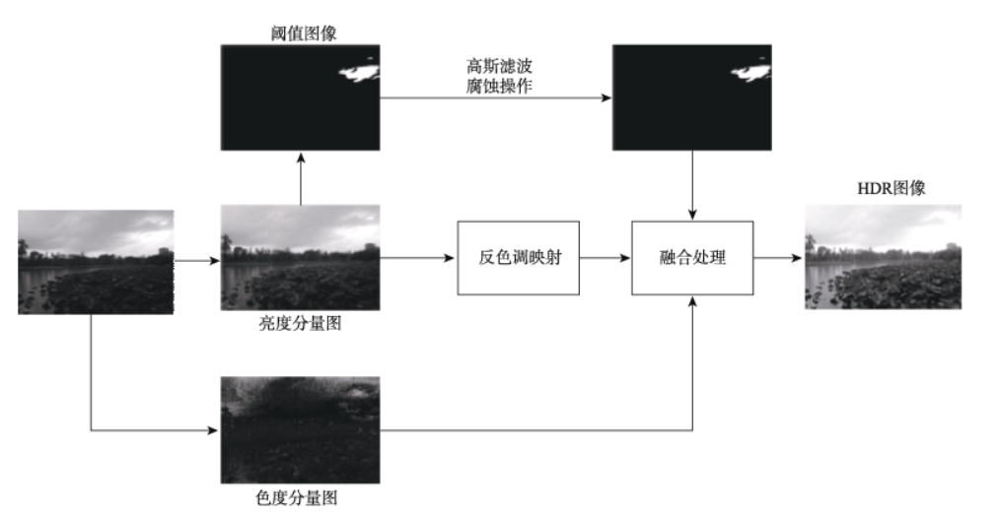

   

   接下来对每个算法步骤进行详细介绍：

   * 反色调映射

     色调映射是将 HDR 图像数据映射成 LDR 图像数据, 并尽可能地在视觉上保留原来的视觉效果. 反色调映射则是色调映射的反变换, 用于增大图像的动态范围, 其对于 LDR 图像到 HDR 图像的转换同样非常关键. 

     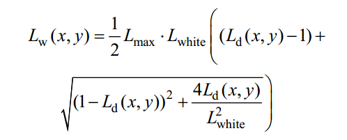

     该式子即为反色调映射的核心算式，其中，Ld(x,y)代表经过色调映射后 LDR 图像的像素点的值. 在映射过程中, 高亮度值的像素点可以近似地看作被 1/L 所量化压缩. 与此同时, 低亮度值的像素点可以看作被 1 量化压缩. 这使得高亮度值像素点在被压缩的同时, 低亮度值像素点的对比度得以保留.

     Lwhite 决定了扩展函数的扩展曲线形状, 与映射后图像的对比度相关, 经过实验表明, 当取值较大时效果较好, 推荐采用 Lwhite=Lmax, 在限制伪像的同时提高对比度. 

     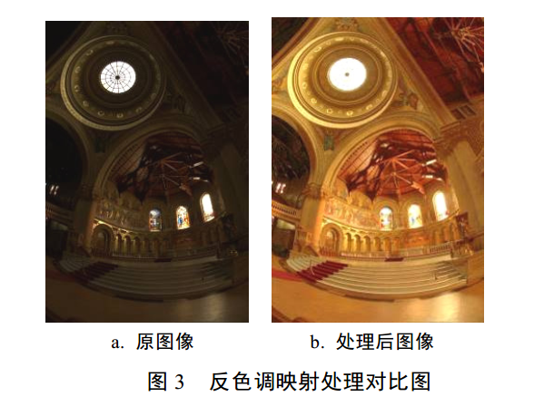

     

   * 高光区域处理

     最初获得的 LDR 图像在高光区域或暗区域往往存在着细节丢失、噪声加大等情况, 虽然无法完美地重现这些在拍摄过程中丢失的信息, 但可以通过一些方法来尽可能地对丢失的信息进行弥补。

     高光区域处理流程图：

     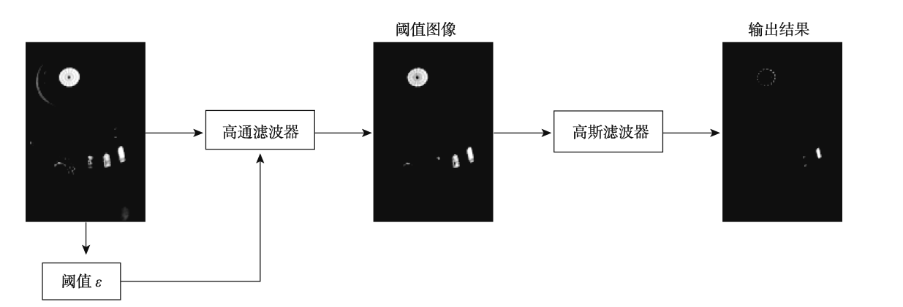

     其中，高通滤波器负责设置相应的滤波阈值，将图像中低于阈值的像素点亮度置为0，过滤掉不必要的噪声：

     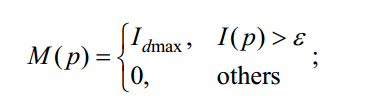

     由于提取出来的阈值图像为二值图像, 在显示中高光区域会与周围区域产生分离, 也就是说容易出现伪影或块效应. 而从光线传输的客观原理以及人的直观感觉来看, 现实世界中的光源所发出的光不会直接截断, 而是随着放射距离变长而出现亮度的衰减. 与此同时, 人眼对于高亮度物体更为敏感, 进一步增强后的图像中高光区域像素点的亮度值会影响周围低亮度值的像素点的细节表现.，所以此处需要引入腐蚀操作：

     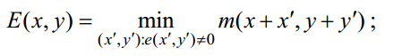

     之后再将腐蚀后的图像输入到高斯滤波器.高斯滤波器是一类根据高斯函数选择权值的线性平滑滤波器. 二维高斯函数对阈值图像有模糊的效果, 其模糊效果能够有效地模拟光线的衰减情况和去除部分噪声, 而腐蚀操作将会减少高光区域对周围像素点的遮盖效果：

     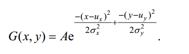

     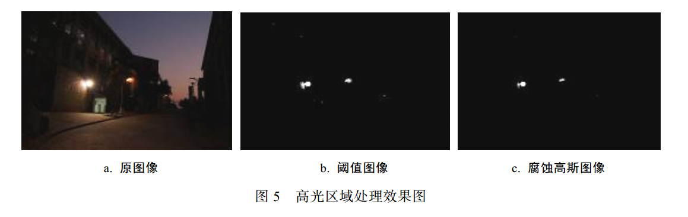

     

   * 图像融合

     经过前面两部分的处理以后还需要将处理得到的图像以及色度分量图进行融合, 得到最终结果. 图像通过反色调映射的全局映射以及高光区域的局部调整后, 在中高亮度部分的表现比较优秀 , 但在暗区域部分并没有很好地保持其原有亮度, 在减小画面对比度的同时还引入了一些新的噪声. 所以在进行图像融合的时候需要对图像的暗区域进行处理：

     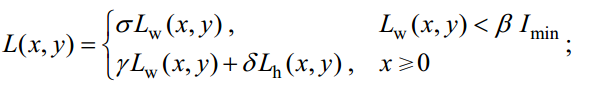

     

   * 总结

     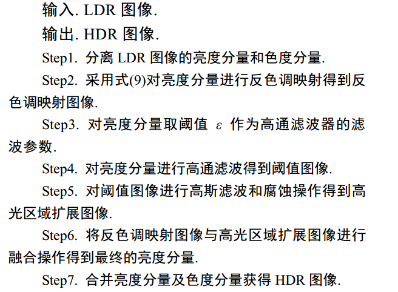

     

2. 算法的效果展示：

   原图：

   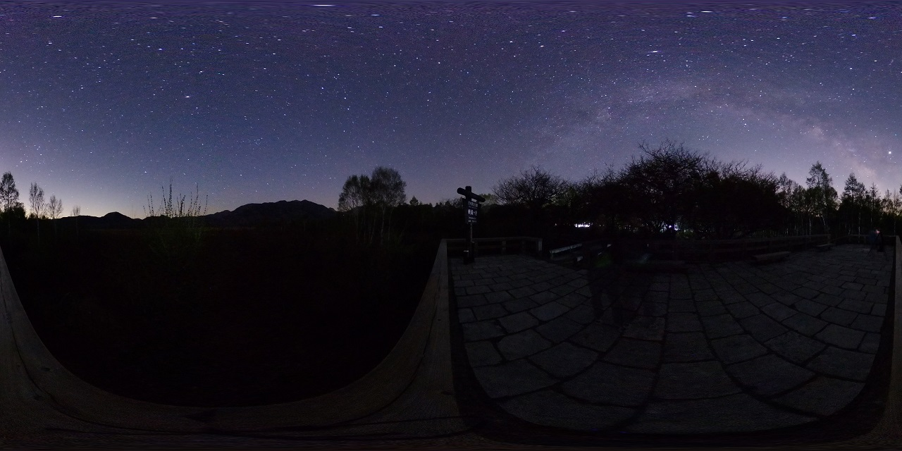


   处理后图：

   

   ​

## 二、 使用快速双边滤波进行HDR算法速度优化

基于快速双边滤波算法，对当前已经实现的HDR算法进行速度上的优化，以保证其在接下来处理视频时，每一帧的渲染时间足够短，使得视频的播放帧数能够维持在每秒几十帧的优秀帧率上。

在保留细节的同时降低对比度。它基于图像的双尺度分解为基础层，编码大规模变化和细节层。只有基层的对比度降低，从而保留了细节。使用称为双边滤波器的边缘保留滤波器获得基础层。这是一个非线性滤波器，其中每个像素的权重是使用空间域中的高斯乘以强度域中的影响函数来计算的，该影响函数减小具有大强度差异的像素的权重。我们在稳健统计框架中表达双边滤波，并展示它与各向异性扩散的关系。然后，我们通过在强度域中使用分段线性近似和适当的子采样来加速双边滤波。这导致加速两个数量级。该方法速度快，无需参数设置。

快速双边滤波算法步骤：

1. 首先他将原始的HDR数据分解成两个层：base layer 和 detail layer,然后降低base layer的对比度，不改变detail layer的数据，其中：base layer的数据用HDR原始数据进行对数操作，获取log layer，然后通过快速双边滤波算法获取，detail layer的数据通过求取log layer与base layer之间的像素值差，保留细节层。

   

2. 最终通过设置一定的compression factor，将detail layer和base layer进行合并，通过反对数运算，生成HDR处理结果图。

   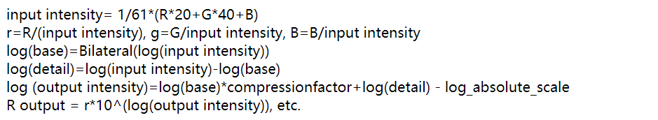


分段线性快速双边滤波过程：

1. 我们将原始图像内的离散化的像素点亮度序列设置为NB SEGMENT，为每个这样的值计算线性滤波器，结合FFT傅里叶变换，为每个像素点计算其滤波之后的像素点值，过程也使用了较为简单的线性插值，结合像素点周围的其余点强度，生成滤波之后的log layer

   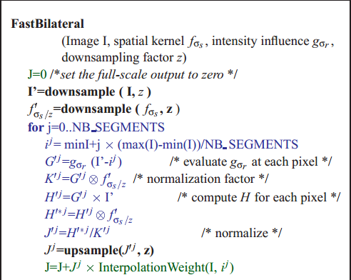

2. 为了进一步优化滤波过程的时间，上述代码中也使用到了下采样操作，对于一个样值序列间隔几个样值取样一次，这样得到新序列就是原序列的下采样。


算法速度提升效果：

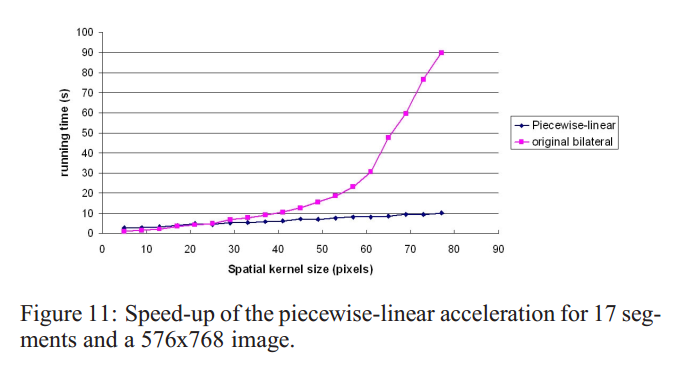


## 三、 HDR算法处理视频的优化过程
1. 结合`Brust Photography`进行高动态场景视频的多帧拟合

   


2. 使用亮度均值调整算法避免视频闪烁情况发生

   


## 四、 实现全景VR视频播放器

框架结构：

- FFMPEG：媒体处理，输出YUV444图像（传给hdr部分进行处理）
- OpenGL：创建球体模型，贴图，渲染
- GLFW：创建显示窗口，处理鼠标键盘输入

首先需要对读取的视频进行解码，这里选择使用FFMPEG库。FFMPEG库提供了许多有用的函数帮助进行视频的解码，格式转换等等，其中有这些类型在解码过程中最为重要：

```
AVFormatContext: FFMPEG解封装(flv, mp4, rmvb, avi)功能的结构体
AVCodecContext: 主要的外部API结构体，用在编解码过程中
AVStream: 存储每个视频/音频流信息的结构体
AVCodec: 存储编解码器信息的结构体
AVFrame: 一般用于存储音视频的（非压缩）原始数据，以及其他一些相关信息
AVPacket: 存储压缩编码数据相关信息的结构体
```

循环中每次读取一帧画面（这里以YUV444格式读取），此时可以得到y，u，v三个通道的数据，将它们传送给hdr处理部分接口，得到处理之后的数据，并将对应通道数据保存至自定义结构体中，以便渲染时使用。


OpenGL渲染部分最为重要的就是球体的渲染，因为最后需要将解码出的画面渲染到球体上。球体自然需要通过顶点生成，但如果全靠顶点可能需要的数量过大，这里可以通过少量顶点连接成的三角形来模拟球体，顶点越多球体当然就越平滑，但同时也会影响渲染性能。这里使用81×81（一层81个，共81层）个顶点来实现一个球体，球体每一层的半径以及顶点的坐标可以通过三角函数计算出来。

最后，通过添加对鼠标事件的相应处理使得可以通过移动鼠标来改变视角，做到自由360°观看全景视频的效果。


实现的球体效果（外部视角）：

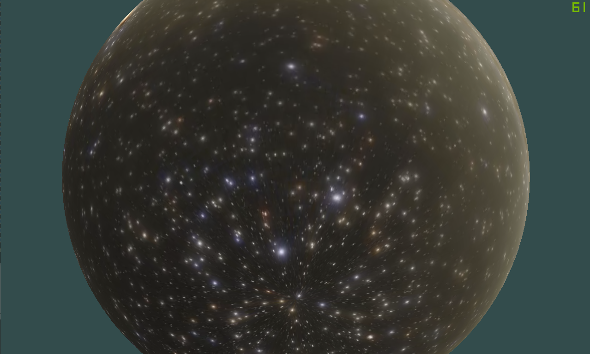


## 五、 实现支持实时渲染HDR视频的播放器
1. HDR算法部分、视频播放器部分模块化

   


2. 


## 六、 实验总结

1. 


2. 


## 七、参考文献

[1] 朱恩弘,张红英,吴亚东,霍永青.单幅图像的高动态范围图像生成方法[J].计算机辅助设计与图形学学报,2016,28(10):1713-1722.

[2] Sam Hasinoff, Dillon Sharlet, Ryan Geiss, Andrew Adams, Jonathan T. Barron, Florian Kainz, Jiawen Chen, and Marc Levoy. Burst photography for high dynamic range and low-light imaging on mobile cameras. SIGGRAPH Asia, 2016.

[3] Durand, Frédo, and Julie Dorsey. "Fast bilateral filtering for the display of high-dynamic-range images." *ACM transactions on graphics (TOG)*. Vol. 21. No. 3. ACM, 2002.

[4] Benjamin Guthier, Stephan Kopf, and Wolfgang Effelsberg. Algorithms for a real-time hdr video system. Pattern Recognition Letters, 34(1):25–33, 2013.

[5] Gabriel Eilertsen, Rafał K Mantiuk, and Jonas Unger. A comparative review of tone-mapping algorithms for high dynamic range video. In Computer Graphics Forum, volume 36, pages 565–592. Wiley Online Library, 2017.